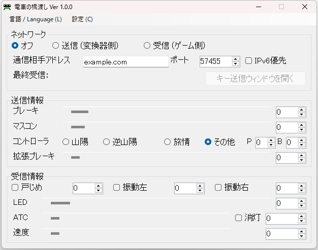

電車の橋渡し
============

[電車でGo！コントローラー変換器](https://autotraintas.hariko.com/) (以下、変換器) の「Mapped(Trial)」で入出力されるメモリマップドファイルの情報、および出力されるキー操作の情報を、UDP で別のコンピュータに転送します。

これを用いることで、変換器が動かないコンピュータでゲームをしたり、ツールの開発をしたりする際、変換器が動く他のコンピュータから情報を受け取って操作できるようになります。

また、メモリマップドファイルの情報を直接表示・編集できるため、変換器が動作する環境や対応コントローラを用意しなくてもツールの開発ができる可能性があります。

変換器の作者とは関係ない、非公式のツールです。
